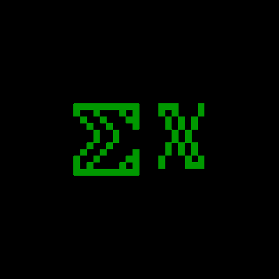

# UnifontEX
An extended fork of GNU Unifont with a focus on high compatibility, made from the last TrueType version of GNU Unifont (15.0.06-JP, which is the most complete), merged with the last version of Upper that will successfully merge after removing the placeholders (11.0.01 Upper). I then did several compatibility steps to make it work under more environments, such as taking SEVERAL measures to make the font work in environments that only want monospace fonts (which Unifont is closer to than something like Times New Roman), as well as fixing the TeX table (among other structures, including stuff like the Panose and OS/2 stuff, among other things), activating Vertical Metrics to make Inkscape not reject it when dealing with Vertical CJKV text, and making the output TTF work best on ALL OS choices. I also used TTF2PNG by Data Beaver's Domain (plus GIMP to make it true 1bpp) to make an unabridged 1 megabyte PNG of the font, for use in situations where TrueType wouldn't make sense, as well as a BDF version also made by FontForge, and a PC-98 font BMP port of UnifontEX made by Neko Project 2 (the Wii port) from the TrueType. (This is for PC-98 emulators that expect ANEX86.BMP), as well as an Apple iOS Safari SVG webfont format version, plus WOFF and WOFF2 versions which are MUCH smaller, as well as the FontForge SFD version (the actual project file). I also added an EOT and a Proof-of-Concept SVGZ version, as well as a Mac DFONT and an X11 otb version for those using relatively-ancient Unix-like OSes. 

## Now, what DOES adding Upper into Unifont offer?

Firstly: You gain the fancy letters intended for math but used online to make social media posts have fancier fonts. This includes Fraktur, which has its own ANSI escape code that is defined but rarely used. Those characters, and their bold versions via the bold flag, now work. 

Secondly: You gain emoji from 2018 and before (nothing newer due to being forced to stick to Unifont 11.0.01 Upper as the Upper version), as well as the rest of the characters in blocks that emoji only uses part of. So yes, you get the whole Playing Cards block, the whole Domino Tiles block, and the whole block allocated to Mahjong tiles. You also get all the symbol characters that didn't get emoji status. Stuff such as U+26FF, which is in the Miscellaneous Symbols block, and just so happens to be equivalent to the Rumpus Parable Agender Pride Flag from 2014. Yes, Unicode has THREE pride flags, not two. Samsung temporarily made the character an Emoji on some Android firmwares of theirs. You get the Alchemical Symbols block, including the Sublimate of Antimony symbol, which has been co-opted by nonbinary people as their gender symbol rather than the traditional male or female symbols (which DO have emoji status). So yes, this build of Unifont features the nonbinary symbol on top of the Plane 0 stuff like the transgender symbol, the symbols for various orientations, the Rumpus Parable flag, and etc. Oh, and unlike MANY Plane 0 fonts, Unifont DOES have U+2B89, something that accidentally resembles a gender symbol in the online LGBTQ+ furry community, one that is rarely used. 

Third: You get many OS symbols not in Plane 0, as well as a full set of Wingdings, Wingdings 2, Wingdings 3, and Webdings, many of which ARE emoji, and many of which are NOT. 

Fourth: You get more geometric symbols and historic scripts.

Fifth: You get both modern and ancient musical notation.

Sixth: You get "Transport and Map Symbols" as part of your emoji set.

Seventh: Having emoji makes you comply with the Shift_JIS extensions made by Japanese telephone carriers. 

Eighth: You can handle more obscure dingbats, as well as the Japanese ARIB captioning character set standard.

Ninth: You have more characters to work with for the purposes of Unicode art, especially when doing animated Unicode art, especially when you are dealing with more than just BW. There's more characters to derive brightness values from. 

Tenth: You can view even the most esoteric Kaomoji (Japanese emoticons that *aren't* emoji, such as the famous table flip one), including the ones that DO use emoji in them.

Eleventh: You gain more types of enclosed letters.

Twelfth: You can pass the current version of the BLNS test (a test file for string handling).

*And that's only the beginning.*

As part of the compatibility focus, the x in the filename "UnifontExMono" is lowercase just in case programs looking for "Mono" to determine monospaced status want a clear distinction. Also, I chose to use no symbols or spaces in the font name to make it work better on picky systems. If your system wants variable fonts, rename the font file to have "--VF" at the end before the extension, which can be .ttf or .otf (yes, TrueType fonts can be made to comply with OpenType too. In FontForge's TTF export, I turned on the "Apple", "OpenType", "Dummy 'DSIG'", "Windows-compatible 'kern'", "TeX Table", "FFTM Table" and ALL the PfaEdit Table checkboxes, so that the font would work on as many systems as possible.) Note that "--" on Linux is what is often used for command-line arguments, so that *could* confuse Linux machines. Also, I chose to make the name of this version of Unifont distinct from the official version, because this is a specialized fork that diverged from non-current versions of Unifont (though not horrifically so by any means). That being said, I `did` take quite a few measures to keep things faithful to the original. Compatibility is key. *That's* why I'm keeping the OS/2 table version identical, not touching the GASP table, and etc. The goal of this project is to build on Unifont to make it even greater than it already is, and to do it one better in many ways. That's why I'm so dedicated to it.

Oh, and by the way: This is a passion project that I have worked on for the last 6 years (maybe 7), in part because I was waiting for new Unicode and Unifont versions to drop so I could see what was in them. This isn't the longest project I have done (that honor goes to two of which I have spent 8 years on), but it certainly was a long haul. I hope that my improvements help you in your endeavors.

In case you wonder why this repo was created a month early, that is so I could write the description to a heightened standard prior to release date, and decide on a name. Expect a better Github Pages site for this, among other things.

### [**Download**](http://stgiga.github.io/UnifontEX/UnifontExMono.ttf)
### [TTF2PNG Build Download](http://stgiga.github.io/UnifontEX/UnifontExMono.png)
### [BDF Download](http://stgiga.github.io/UnifontEX/UnifontExMono-16.bdf)
### [UnifontEX PC-98 font BMP Download](http://stgiga.github.io/UnifontEX/UFEXPC98.BMP) 
### [Apple iOS SVG Webfont version Download](http://stgiga.github.io/UnifontEX/UnifontExMono.svg)
### [WOFF Download](http://stgiga.github.io/UnifontEX/UnifontExMono.woff)
### [WOFF2 Download](http://stgiga.github.io/UnifontEX/UnifontExMono.woff2)
### [FontForge SFD Download](http://stgiga.github.io/UnifontEX/UnifontExMonoSFD.7z)
### [EOT Download](http://stgiga.github.io/UnifontEX/UnifontExMono.eot)
### [macOS DFONT Download](http://stgiga.github.io/UnifontEX/UnifontExMonoDFONT.7z)
### [OTB Download](http://stgiga.github.io/UnifontEX/UnifontExMono.otb)

### [Proof-of-Concept SVGZ Download](http://stgiga.github.io/UnifontEX/UnifontExMono.svgz)

Oh I am legally obligated to say that GNU Unifont is under GPL2 with font embedding exception and OFLv1.1, and can be found [here](https://unifoundry.com/unifont/index.html) and is by Roman Czyborra and Paul Hardy, et. al.

Also, my real-life name is NOT something I give out online willy-nilly, just in case you find yourself needing to know it to follow the crediting part of GPL2, in which case you should credit me as "stgiga". Online, I basically only use aliases, because I'm VERY paranoid about online safety, especially given the fact that I quite literally am certified in cybersecurity. And yes, you would be right in assuming that I use this Unifont build in my IDEs and terminals. As well as my Ubuntu window titles. As well as other stuff. 

With that out of the way, I hope you enjoy this project as much as I enjoyed making it! Have fun, and do honor the original devs of Unifont. They do great work. Enjoy!

Also, if you want more glyphs (such as emoji from 2019 and newer, including the ones related to assistive technology) than can fit in the 65535 glyph limit in a TrueType/OpenType/WOFF/WOFF2, please tell the OS and browser vendors to bring back Apple's iOS Safari pure-SVG webfont format (which, unlike SVG-in-OpenType, supports unlimited glyphs, so you could fit in ALL variation sequences if you wanted, define arbitrary tables like porting Apple's Zapf table used by Zapfino, as well as porting the animation and color tables from SVG-in-OpenType, and also using even Microsoft's diverse family ZWJ sequences. Also, you can embed PNGs for bitmap glyphs to help with rendering if you want, and implement the contextual shaping in scripts like Arabic, without worrying about glyph counts, especially when working with ALL scripts that have variations. Oh, and while uncompressed SVG fonts would be large (most likely why they got eschewed), I *did* try a merger of GNU Unifont 15.0.0x with 15.0.0x Upper with 15.0.0x CSUR (something VERY impossible in TTF/OTF), and then made it into an SVGZ (officially-standardized GZipped SVG, but has no MIME Type), and it gave a result that was the same size as a WOFF2 of my TrueType merger. So, have the OS vendors support SVGZ as part of the equation too. Also, please tell the W3C to give SVGZ its own MIME type so it can be better-supported by browsers again so that with the help of XHTML integration, we can have smaller webpages for people on slower connections, without having to fiddle around with Apache's httpd.conf or IIS's equivalent to it. Oh, and SVG(Z) webfonts would also allow the entire Unicode Code Charts font to be usable as a fallback font in OSes if needed, which could prevent missing character varieties of Mojibake entirely (assuming no Private Use Area characters are used.) It would be an even more successful fix than Noto or UnifontEX could ever be. All it takes is for the OS vendors, browser vendors, the W3C, and the Unicode Consortium to team up. But until that happens, we are stuck with what we currently have: 65535 glyphs maximum due to TrueType/OpenType/WOFF/WOFF2 limits, and httpd.conf editing to allow loading of any SVGZ content, to the point where you need to set up a server even if you are running it offline. 

Also, regarding the above, I am NOT in favor of anyone engaging in harassment when asking. Harassment is one of the MANY bad things I *personally* have endured from a young age, so please don't engage in it. I figured I should say this to avoid any possible drama. I'm someone who absolutely hates drama of any kind. With that out of the way, I hope that there will be better support coming soon. 

### More facts, use cases, and information:

Oh fun fact: The 16px size of UnifontEX's emoji (namely the fullwidth ones) is actually slightly bigger than the 1999 DoCoMo emoji (which were 12x12), but the 1997 SkyWalker phone by SoftBank (which was the first *mobile* emoji set, because some earlier Sharp and Canon typewriters had what we would now call emoji on them *in 1991*, according to [emoji.digital](http://emoji.digital) which has a whole section on them) used 32x32 emoji in Emojipedia's examples of them, but looking at the image directly implies they were doubled from 16x16 by Emojipedia.

The fun thing about UnifontEX being 16px though is that 16px on Windows is actually 12-point. Now, the MLA style guide that educators often use does not force Times New Roman, only "a readable 12-point font" (some educators *will* force Times New Roman, and APA DOES force Times New Roman in SOME versions, so don't do your papers in UnifontEX unless you have permission AND are using MLA or any other style guide that does not force Times New Roman), so, depending on the educator, you COULD write your papers in UnifontEX if you are using MLA or another permissive style guide. I mean, Unifont *is* `exactly` 12-point on Microsoft systems, it just has no subpixels *at all*. Also, I'm VERY sure that using emoji in your papers would be a `very` *bad* idea. Now, IF you work as, for example, a technical writer (which is the career path I am on), there is `no` better font than UnifontEX. It's 12-point, and it has MANY technical symbols and pictographs in it, even compared to stock Unifont. Oh, I should mention that large-print medicine bottles in the United States (or at least California) are printed at 12-point. So, 12-point is *not* considered an unreadable font size.

Now, I should also mention that ANOTHER thing that UnifontEX is useful for is stuff like creative writing, particularly if you are exporting to PDF. Quite a few sites with literature sections do stuff in PDF. I also use Firefox to force ALL page fonts on ALL websites to UnifontEX. Also, on Windows 11, any emoji involved that are newer than 2018 will be rendered by Segoe UI Emoji, so modern emoji DO show up.

Also, I feel like web literature would be something UnifontEX would be handy to use in, so writers could have access to technical symbols in something like sci-fi stories. I certainly know that anything I write from now on WILL feature this font, because it has quite a few special symbols handy for some of the things I intend to write. Now, when I'm actually working as a technical writer, I will be using a UnifontEX build in which I turn on the "No Subsetting" box in FontForge, meaning that apps like Word will never subset the font. At that point, I could afford the storage overhead, and it would allow collaborators who do not have the font to work with the document. However, I DO know that quite a few existing sites DO cap PDF size, so to avoid possible bugs on your end, the UnifontEX released here does not have that box checked, so have no fear of oversized files.

Now, I'm stating the obvious here, but if you integrate this into whatever you do, avoid doing something with it that would truly enrage the FSF. When in doubt, ask. 

Additionally: Another use I've found for this font is for boosting Unicode support on legacy systems. You even get emoji (up to 2018, but then you get Plane0 characters up to 2023, so stuff such as the Reiwa Era symbol, the Symbol For Type A Electronics, and quite a few of the extensions of certain scripts that were slotted into Plane0 are all present.)
Throw this into ReactOS, and you have better Unicode support. Or you can give older-than-dirt machines better Unicode support, which can help if using InterWebPPC on a Tiger or better PowerPC Mac with a G3 or better (even a Power Mac 7500 can be coaxed into running a Mac OS X version that will work, but it will be slow), or Basilisk XPMod IA-32 (Firefox fork) on Windows XP with a Pentium 1, or Firefox 52 + KernelEx on Windows 98, and allow the modern web to be more browsable on older machines, especially if emoji is involved. It's even useful for updating the emoji support of machines just old enough to be stuck on older emoji versions with no upgrade paths, but not ones from the 1990s or prior to the 2010s. For instance, I have a 2013 MacBook Air running Mac OS X 10.9 Mavericks (also 2013), and it has such a small drive that it was always upgrade-challenged with regards to macOS versions. Adding UnifontEX allowed it to go from 2013 emoji (the year before Wingdings, Wingdings 2, Wingdings 3, Webdings, and the other dingbats and characters added into Unicode then were added) to 2018 emoji plus many more symbols, including Unicode 15 Plane 0. So, if you are using a secondhand computer, you can attain fairly-reasonable levels of Unicode support, even without installing something such as Linux, BSD-family OSes, or Hurd (yes, I know what that is.) Many people are stuck with older machines for one reason or another, and UnifontEX can assist with how they handle Unicode, especially given how often people on various websites use Unicode to make fancy text. Being able to at least see *something* other than mojibake or boxes is a good thing. Personally, I just tell Firefox to set ALL page fonts to UnifontEX, but that isn't strictly necessary. 

Also, now your terminal and IDE can support Unicode better, which can definitely help when localizing stuff.

Additionally, all the circled and boxed letters, the checkboxes, radio buttons, check marks, X marks, the number+dot/comma, etc. al. and the consistent font pixel size make using UnifontEX for *creating* school assignments, surveys, or polls very attractive. Oh and yes, I've physically printed UnifontEX documents and they look fine. It *is* after all, the size recommended for essay text, and the font size for California large-print medicine bottle labels.

## TL;DR: UnifontEX's use cases could fill a book (literally). This README is lagging my Firefox, so I'm not going to start listing more (not to mention I'm falling asleep at my keyboard so don't expect a SourceForge readme update today). Go enjoy UnifontEX! 

